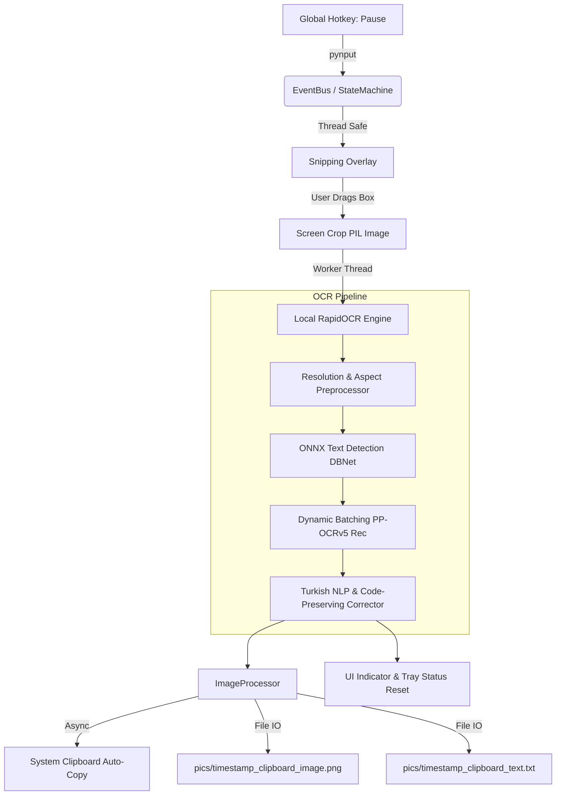

# ⚡ SnipOCR

> Ultra-fast, offline screen snipping and optical character recognition (OCR) desktop utility for Windows, powered by in-process **ONNX Runtime** and **Latin PP-OCRv5** with high-throughput **Turkish NLP correction**.

[](https://microsoft.com/windows)
[](https://www.python.org/)
[](https://github.com/RapidAI/RapidOCR)
[](LICENSE)
[](FIX_REPORT.md)

---

## 📖 Overview

**SnipOCR** is a lightweight, low-latency, privacy-first desktop utility that brings seamless screen-to-text functionality to Windows. Pressing a single global hotkey (`Pause`) freezes the screen with an interactive selection overlay, extracts clean text within milliseconds, and immediately copies the result to your clipboard while saving an image/text snapshot locally.

Unlike traditional OCR tools that rely on cloud APIs or heavy external server processes, SnipOCR runs **entirely in-process on CPU** via ONNX Runtime and SIMD vectorization. It features an advanced NLP post-processing engine specially designed for high-accuracy Turkish diacritic handling and code syntax preservation.

---

## ✨ Key Features

- **🚀 100% Offline & Local Execution:** No cloud calls, no external microservices, zero telemetry. All inferences execute directly on your CPU.
- **⚡ Native Resolution Detection:** Bypasses unnecessary 960px minimum side scaling (`limit_type="max"`), preserving razor-sharp text edges on UI widgets, command lines, and terminals while reducing detection pixel counts by up to **40×**.
- **🧠 Advanced Turkish NLP & Spell Correction:**
  - Integrated with an indexed dictionary of **380,000+ words** and dynamic Turkish conjugations.
  - **Bounded (≤1 edit distance) O(1) spell corrector:** Custom length/first-char hash indexing executes lookups in **~1 ms for 400+ words** (**~20,000× faster** than classical Levenshtein dynamic programming).
  - Phonetic & diacritic equivalence clustering (`ç/c`, `ğ/g`, `ı/i`, `ö/o`, `ş/s`, `ü/u`).
  - Code-aware: Safely bypasses `camelCase`, `snake_case`, URLs, CLI flags, and programming symbols.
- **🖥️ Multi-Monitor & DPI-Aware:** Automatically identifies the active display based on mouse cursor position, captures exact physical coordinates, and adapts to Per-Monitor V2 DPI scaling.
- **🎯 System Tray & Floating HUD:**
  - Persistent Windows System Tray icon with dynamic state tracking (Idle / Busy).
  - Non-intrusive semi-transparent floating "OCR" indicator displayed during processing.
- **🛡️ Thread-Safe & Hardened Architecture:**
  - Windows Process Priority set to `ABOVE_NORMAL_PRIORITY_CLASS` to eliminate background scheduler throttling.
  - Safe Tkinter thread-marshaling: all GUI destructions and creations are routed through `root.after()`.
  - Non-blocking OCR watchdog preventing hung states.
  - Native crash telemetry (`faulthandler` + `sys.excepthook` + `threading.excepthook`).

---

## 🏗️ Architecture & Pipeline



---

## 📊 Benchmarks & Performance

Tested on **AMD Ryzen 5 9600X (6 Cores / 12 Threads)** on Windows 11 with ONNX Runtime:

| Scenario | Input Resolution | End-to-End Latency | Output Characters | Notes |
|:---|:---:|:---:|:---:|:---|
| **Engine Warmup** | 100×32 | **0.04s** | - | Graph initialization at startup |
| **Small Text Snippet** | 420×39 | **0.11s** | 27 chars | Auto 1.5×/2× upscale tier |
| **Code Block** | 700×132 | **0.47s** | 158 chars | Preserves indents & syntax |
| **Turkish Paragraph** | 900×195 | **0.74s** | 266 chars | Full Turkish NLP correction |
| **Wide CLI Command** | 1250×45 | **1.12s** | 103 chars | Flags & Windows paths intact |

### Spell Corrector Speedup

| Algorithm | 400-Word Benchmark | Speedup Factor |
|:---|:---:|:---:|
| Full Levenshtein DP Matrix | 20.020 s | Baseline (1.0×) |
| **SnipOCR Bounded Hash-Bucket Corrector** | **0.001 s** | **19,950× faster** |

---

## 📂 Project Structure

```
ocrPython/
├── main.py                     # Application entry point, crash logging, Tk root
├── requirements.txt            # Python dependencies
├── benchmark_ocr.py            # Comprehensive benchmark & verification suite
├── FIX_REPORT.md               # Thread safety & stability audit report
├── models/                     # In-process models & dictionaries
│   ├── det_model.onnx          # PP-OCRv5 Detection ONNX model
│   ├── rec_model.onnx          # Latin PP-OCRv5 Recognition ONNX model
│   ├── rec_keys.txt            # Character vocabulary keys
│   └── turkish_words.txt       # Turkish lexicon (380k+ words & stems)
├── scripts/
│   └── stress_snipocr.py       # Automated hotkey stress test harness
├── src/
│   ├── app.py                  # Core orchestrator & event coordinator
│   ├── config.py               # Tunable constants, thresholds, and paths
│   ├── core/
│   │   ├── bus.py              # Lightweight publish/subscribe event bus
│   │   ├── hotkey.py           # Debounced global Pause key listener
│   │   ├── processor.py        # Clipboard writer & disk snapshot persistence
│   │   └── state.py            # App state machine (IDLE, SNIPPING, PROCESSING)
│   ├── engine/
│   │   ├── base.py             # Abstract OCR engine interface
│   │   └── local_engine.py     # RapidOCR engine, thread tuning, NLP corrector
│   ├── overlay/
│   │   ├── base.py             # Base transparent canvas overlay
│   │   └── snipping.py         # Multi-monitor drag-to-select snipping tool
│   ├── platform/
│   │   └── windows.py          # Windows API bindings (DPI, priorities, monitors)
│   └── ui/
│       ├── indicator.py        # Floating HUD notification window
│       └── tray.py             # System tray icon with context menu
```

---

## 🚀 Getting Started

### Prerequisites

- **Operating System:** Windows 10 or Windows 11 (64-bit)
- **Python:** Python 3.10, 3.11, or 3.12
- **Hardware:** Multi-core x86_64 CPU supporting AVX2 (Intel Core 4th Gen+ / AMD Ryzen)

### Installation

1. **Clone the repository:**
   ```powershell
   git clone https://github.com/userlessname/ocr_python.git
   cd ocr_python
   ```

2. **Create and activate a virtual environment:**
   ```powershell
   python -m venv .venv
   .\.venv\Scripts\Activate.ps1
   ```

3. **Install dependencies:**
   ```powershell
   pip install --upgrade pip
   pip install -r requirements.txt
   ```

---

## 🎮 Usage

1. **Launch the application:**
   ```powershell
   python main.py
   ```
   On launch, SnipOCR minimizes to the Windows System Tray and preloads the ONNX models into RAM in the background (~1.1 seconds).

2. **Capture text:**
   - Press the **`Pause`** key on your keyboard (or click **Capture Now** from the system tray menu).
   - Click and drag across the screen to draw a selection rectangle over any text.
   - Release the mouse button.

3. **Get results:**
   - The floating **OCR** indicator will appear briefly in the top-right corner.
   - Extracted text is **automatically copied to your clipboard**. Paste it anywhere with `Ctrl + V`.
   - The snip image and raw text are archived under `pics/`:
     - `pics/<timestamp>_clipboard_image.png`
     - `pics/<timestamp>_clipboard_text.txt`

4. **Cancel selection:**
   - Press **`ESC`** at any point during snipping to cancel without capturing.

5. **Exit:**
   - Right-click the system tray icon and select **Exit**, or send `Ctrl + C` in the terminal.

---

## ⚙️ Configuration

Key settings can be customized in [`src/config.py`](src/config.py):

| Parameter | Default | Description |
|:---|:---:|:---|
| `DET_LIMIT_TYPE` | `"max"` | Detection boundary behavior (`"max"` retains native resolution) |
| `DET_LIMIT_SIDE_LEN` | `960` | Maximum bounding dimension for text detection |
| `REC_BATCH_NUM` | `12` | Batch size for recognition crops per inference step |
| `HOTKEY_DEBOUNCE_INTERVAL` | `2.0` | Minimum seconds between consecutive hotkey presses |
| `HOTKEY_SESSION_RECOVERY` | `1.5` | Cooldown period before re-arming the hotkey |
| `SMALL_TEXT_2X_MAX_HEIGHT` | `36` | Height threshold (px) below which 2× upscaling applies |
| `TURKISH_CORRECTION_MIN_HEIGHT` | `60` | Minimum image height to activate Turkish spell correction |
| `TURKISH_CACHE_MAX_SIZE` | `4096` | Max entries in the in-memory spell correction cache |

---

## 🧪 Testing & Verification

### Run the OCR Benchmark
Validates model initialization, Turkish spell-correction unit tests, and real end-to-end OCR accuracy:
```powershell
python benchmark_ocr.py
```

### Run Stability & Stress Harness
Launches the app, simulates rapid hotkey spamming, monitor transitions, and forced interrupts to ensure zero deadlocks or Tkinter access violations:
```powershell
python scripts/stress_snipocr.py
```

---

## 🛡️ Stability & Hardening

SnipOCR has undergone extensive stress testing and architectural hardening. Refer to [`FIX_REPORT.md`](FIX_REPORT.md) for details on:
- Prevention of Tkinter cross-thread teardown access violations.
- Asynchronous watchdog timer race resolution.
- Thread-safe ONNX model session locking to prevent use-after-free conditions.
- Windows Per-Monitor V2 DPI awareness and task scheduling priority management.

---

## 📄 License

This project is licensed under the MIT License — see the [LICENSE](LICENSE) file for details.
