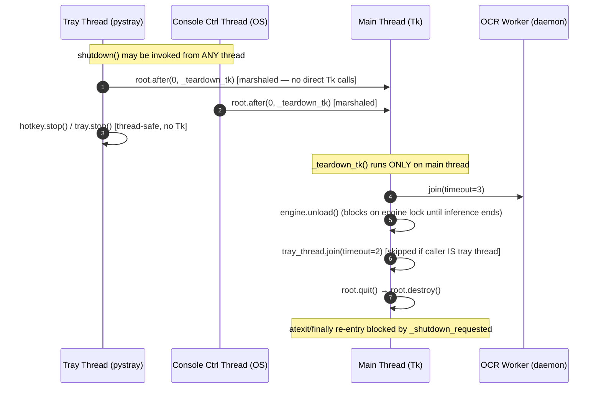
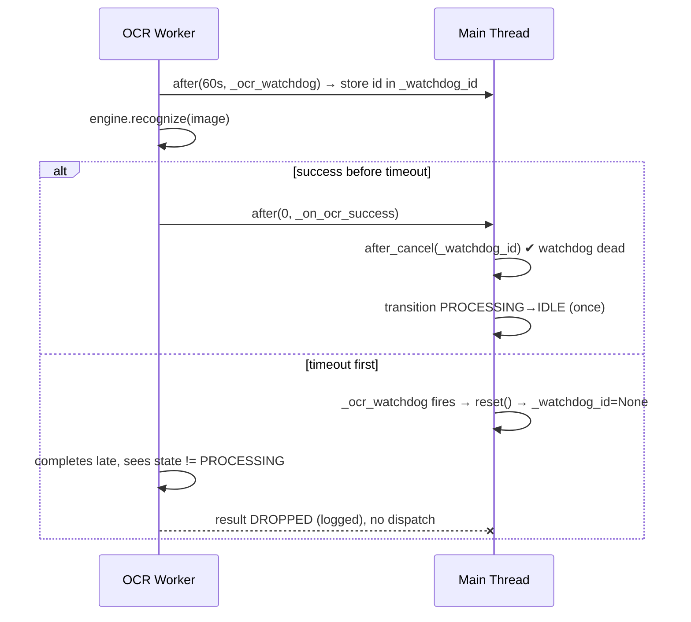
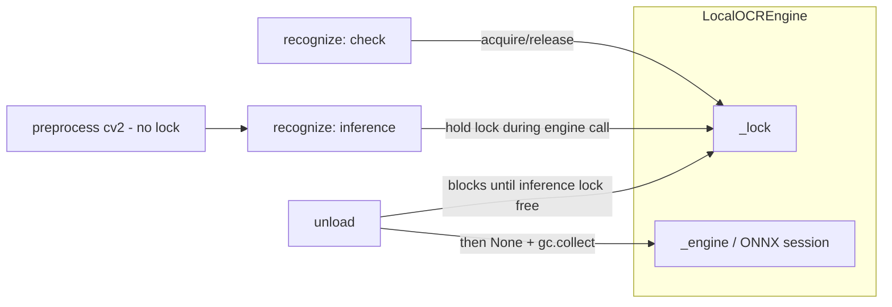

# 🛠️ Implementation Plan — SnipOCR Intermittent Crash Elimination

> **Goal**: Eliminate intermittent process crashes of the SnipOCR desktop app.
> **Primary root cause (validated by research, score 97/100)**: shutdown executed on a **non-Tk thread** (tray exit menu / console control handler) performs direct Tk calls (`root.quit()`, `root.destroy()`) while the daemon tray thread is still alive → Tcl/Tk access violation. Secondary: OCR watchdog race, ONNX session use-after-unload, unguarded `__del__` finalizers.
> **Constraint**: NO changes to OCR models, OCR heuristics, Turkish NLP logic, [`requirements.txt`](requirements.txt), or tuning constants in [`src/config.py`](src/config.py).

---

## 1. Crash Vector → Fix Mapping

| ID | Priority | Vector | Root Cause | Fix Phase |
|----|----------|--------|------------|-----------|
| V4+V3 | 🔴 CRITICAL | Tk teardown from non-main thread + unjoined daemon tray thread + unsafe `__del__` | [`src/app.py`](src/app.py:95) `shutdown()` calls `root.quit()/destroy()` from whichever thread invoked it (tray menu callback runs in the pystray thread; console handler runs on an OS thread); tray thread never joined | **Phase 1** |
| V1 | 🔴 CRITICAL | Watchdog vs OCR worker race | [`src/app.py`](src/app.py:228) schedules watchdog via `root.after()` with **no `after_cancel()`** → double state transition + duplicate UI calls | **Phase 2** |
| V8 | 🟠 HIGH | ONNX session use-after-unload | [`src/engine/local_engine.py`](src/engine/local_engine.py:545) caches `engine` ref, releases lock, then infers; concurrent `unload()` frees the C++ session → segfault | **Phase 3** |
| V5 | 🟡 LOW | Duplicate `atexit` handler | [`src/app.py`](src/app.py:84) registers `shutdown_engine` targeting an unused global singleton | **Phase 1** (cleanup) |
| V2 | 🟡 LOW | Overlay re-instantiation | Currently guarded by state machine, but no explicit dedup flag (defense-in-depth) | **Phase 4** |
| V9 | 🟡 LOW | Tk calls after root destroyed | [`src/app.py`](src/app.py:93) `request_snipping()` → `root.after()` on destroyed root → `TclError` | **Phase 4** |
| V6 | ⚪ DORMANT | EventBus stale handlers | Bus is instantiated but never subscribed; **no change** (documented only) | — |
| V7 | ⚪ NON-CRASH | OMP thread oversubscription | Performance only; **no change** | — |

---

## 2. Target Architecture (After Fix)

### 2.1 Thread-Safe Shutdown Sequence



### 2.2 Watchdog Lifecycle (Fixed)



### 2.3 Engine Lock Ownership



---

## 3. Phase 0 — Crash Diagnostics (precondition for validation)

### 3.1 File checklist
- [ ] [`main.py`](main.py) — add faulthandler + excepthooks + rotating file log

### 3.2 Changes

**[`main.py`](main.py)** — inside [`main()`](main.py:44), immediately after [`_setup_logging()`](main.py:36) call:

1. Add module-level imports: `import faulthandler`.
2. Extend `_setup_logging()` to also attach a `logging.FileHandler("snipocr.log", mode="a", encoding="utf-8")` at INFO level (keep existing console handler).
3. Enable fault handler writing to a persistent file opened in append mode (`crash.log` in project root). Keep the file handle in a module global so it is not GC'd.
4. Install hooks:
   - `sys.excepthook` → log `CRITICAL` with `exc_info`, then delegate to `sys.__excepthook__`.
   - `threading.excepthook` → log `CRITICAL` with thread name and `exc_info`.

### 3.3 Edge cases
- `crash.log` not writable (read-only dir) → wrap open in `try/except`, fall back to `faulthandler.enable()` (stderr).
- Python < 3.8 lacks `threading.excepthook` → guard with `hasattr(threading, "excepthook")`.

### 3.4 Verification
```powershell
python main.py ; Get-Content crash.log -Tail 5
# Trigger a deliberate exception in a worker (temporary), confirm it lands in crash.log, then revert.
```

---

## 4. Phase 1 — Shutdown Integrity (V4 + V3 + V5) 🔴

### 4.1 File checklist
- [ ] [`src/app.py`](src/app.py) — thread-marshaled shutdown, tray thread join, remove duplicate atexit
- [ ] [`src/core/hotkey.py`](src/core/hotkey.py) — idempotent `stop()`, safe `__del__`
- [ ] [`src/ui/tray.py`](src/ui/tray.py) — safe `__del__`
- [ ] [`src/overlay/base.py`](src/overlay/base.py) — safe `__del__`, `None`-guarded `close()`

### 4.2 [`src/app.py`](src/app.py) changes

1. **Imports (line 22)**: remove `shutdown_engine` from the import; keep `LocalOCREngine`.
2. **`__init__` (after line 58)**: add `self._tray_thread: Optional[threading.Thread] = None`.
3. **`start()` (lines 76–77)**: replace local `tray_thread` with `self._tray_thread = threading.Thread(target=self._tray.run, daemon=True, name="tray")`; `self._tray_thread.start()`.
4. **`start()` (line 84)**: delete `atexit.register(shutdown_engine)` — the app-owned engine is unloaded in `shutdown()`; the global singleton is never instantiated.
5. **Split [`shutdown()`](src/app.py:95) into two methods**:
   - `shutdown(signum=None, frame=None)` — callable from **any** thread:
     - Re-entry guard via `_shutdown_requested` (keep, set FIRST).
     - `self._ocr_ready.set()` (unblock workers waiting on model load).
     - Thread-safe stops wrapped individually in `try/except`: `self._hotkey.stop()`, `self._tray.stop()`.
     - Join OCR worker (`timeout=3`) — existing logic, keep.
     - Join tray thread: `if self._tray_thread is not None and threading.current_thread() is not self._tray_thread: self._tray_thread.join(timeout=2)` (self-join guard → `RuntimeError` otherwise).
     - `self._ocr_engine.unload()` in `try/except` (now blocks safely on engine lock — Phase 3).
     - `self._bus.clear()` in `try/except`.
     - **Tk teardown marshaling**:
       ```python
       if threading.current_thread() is threading.main_thread():
           self._teardown_tk()
       else:
           try:
               self._root.after(0, self._teardown_tk)
           except Exception:
               pass  # root already gone; process is exiting anyway
       ```
   - `_teardown_tk()` — **main thread only**: `root.quit()` then `root.destroy()`, each in its own `try/except` (existing lines 137–144 move here).
6. **[`request_snipping()`](src/app.py:91)**: wrap `self._root.after(0, self._try_start_snipping)` in `try/except Exception` with a debug log — a hotkey event arriving during teardown must not raise `TclError` on the pynput thread.

### 4.3 [`src/core/hotkey.py`](src/core/hotkey.py) changes

1. **[`stop()`](src/core/hotkey.py:44)** → idempotent, exception-safe:
   ```python
   def stop(self) -> None:
       listener = self._listener
       self._listener = None
       if listener is not None:
           try:
               listener.stop()
           except Exception as exc:
               _logger.warning("Error stopping hotkey listener: %s", exc)
           else:
               _logger.info("Hotkey listener stopped.")
   ```
2. **[`__del__()`](src/core/hotkey.py:32)**: wrap `self.stop()` in `try/except Exception: pass` (interpreter-finalization safe).

### 4.4 [`src/ui/tray.py`](src/ui/tray.py) changes

1. **[`__del__()`](src/ui/tray.py:46)**: wrap `self.stop()` in `try/except Exception: pass`.

### 4.5 [`src/overlay/base.py`](src/overlay/base.py) changes

1. **[`__del__()`](src/overlay/base.py:31)**: wrap `self.close()` in `try/except Exception: pass`.
2. **[`close()`](src/overlay/base.py:47)**: early-return when `self._cleaned_up or self.root is None` (avoids `AttributeError` noise on partially constructed overlays).

### 4.6 Edge cases
| Case | Handling |
|------|----------|
| Exit via tray menu **during OCR** | shutdown runs on tray thread → Tk teardown marshaled; OCR joined; engine unload waits on lock |
| Console X / logoff ([`windows.py:42`](src/platform/windows.py:42) handler thread) | Same marshaling path; handler returns True after scheduling |
| Ctrl+C (SIGINT on main thread) | Direct `_teardown_tk()` — no marshal needed |
| Double shutdown (atexit + `finally` in [`main.py:72`](main.py:72)) | `_shutdown_requested` guard, first line |
| Tray thread self-join | Guarded by `current_thread() is not self._tray_thread` |
| `root.after()` on destroyed root | `try/except` in both `shutdown()` marshal and `request_snipping()` |
| GC finalization order (`__del__` when module globals are torn down) | Broad `except Exception` in all three `__del__`s |

### 4.7 Verification
```powershell
# Run app, snip once, exit via tray DURING a second OCR (busy icon), expect clean exit code 0
python main.py
echo $LASTEXITCODE
# Expect: no Tcl error on stderr, no ghost tray icon, snipocr.log shows orderly shutdown lines
```

---

## 5. Phase 2 — Watchdog Race (V1) 🔴

### 5.1 File checklist
- [ ] [`src/app.py`](src/app.py) — cancellable watchdog + late-result drop

### 5.2 Changes

1. **`__init__`**: add `self._watchdog_id: Optional[str] = None`.
2. **[`_ocr_worker()`](src/app.py:217)** at line 228: capture the id —
   `self._watchdog_id = self._root.after(OCR_WATCHDOG_SECONDS * 1000, self._ocr_watchdog)`.
3. **Late-result guard** (after `recognize()` returns, before saving/dispatching at lines 236–240):
   ```python
   if self._state_machine.state != AppState.PROCESSING:
       _logger.warning("OCR completed after watchdog reset — dropping result.")
       return
   ```
   This prevents clipboard/file writes **and** the double `PROCESSING→IDLE` transition.
4. **[`_ocr_watchdog()`](src/app.py:245)**: set `self._watchdog_id = None` as the first statement (timer already fired; id is stale).
5. **Cancel on completion** — add a small helper `_cancel_watchdog()` called first in both [`_on_ocr_success()`](src/app.py:255) and [`_on_ocr_error()`](src/app.py:260):
   ```python
   def _cancel_watchdog(self) -> None:
       if self._watchdog_id is not None:
           try:
               self._root.after_cancel(self._watchdog_id)
           except Exception:
               pass
           self._watchdog_id = None
   ```

### 5.3 Edge cases
- `after_cancel` with an already-fired id → `ValueError` inside Tcl → swallowed by `try/except`.
- Worker finishes between watchdog fire and cancel → guard in 5.2.3 drops the result; UI already reset — consistent.
- Multiple OCR cycles → id is overwritten per cycle and always nulled on fire/cancel; no leak.

### 5.4 Verification
```powershell
# Temporarily set OCR_WATCHDOG_SECONDS=1 in config, snip a large region, confirm:
# log shows "watchdog fired" then "dropping result", state returns IDLE, hotkey usable.
# Revert config after test.
```

---

## 6. Phase 3 — Engine Inference Lock Scope (V8) 🟠

### 6.1 File checklist
- [ ] [`src/engine/local_engine.py`](src/engine/local_engine.py) — guard inference with `self._lock`

### 6.2 Changes to [`recognize()`](src/engine/local_engine.py:537)

Keep preprocessing **outside** the lock (no engine access); wrap the ONNX call:

1. Existing check block (lines 545–548) stays as-is (early fail).
2. Before the inference call (line 563), re-acquire and re-validate:
   ```python
   with self._lock:
       if not self._loaded or self._engine is None or self._engine is not engine:
           raise RuntimeError("OCR engine was unloaded during preprocessing.")
       results, elapse_list = engine(proc_np)
   ```
   Holding the lock across `engine(proc_np)` guarantees [`unload()`](src/engine/local_engine.py:529) cannot free the session mid-inference; `unload()` simply waits, then proceeds.

### 6.3 Edge cases
- Shutdown during preprocess → second check raises `RuntimeError` → worker's `except` → `_on_ocr_error` → clean IDLE reset (no segfault).
- Shutdown during inference → `unload()` blocks until inference completes (bounded by model runtime, seconds); shutdown join timeout unchanged (join happens **before** unload — order in Phase 1 preserved).
- Re-entrancy: only one OCR worker exists at a time (guarded in [`_on_image_captured()`](src/app.py:188)); no deadlock risk since worker never re-acquires recursively.

### 6.4 Verification
```powershell
python benchmark_ocr.py
# Expect identical OCR output vs pre-fix run and clean "engine E2E done".
```

---

## 7. Phase 4 — Overlay Hardening (V2 + V9) 🟡

### 7.1 File checklist
- [ ] [`src/app.py`](src/app.py) — explicit overlay-active flag
- [ ] [`src/overlay/snipping.py`](src/overlay/snipping.py) — parent liveness check

### 7.2 [`src/app.py`](src/app.py) changes
1. **`__init__`**: add `self._overlay_active = False`.
2. **[`_try_start_snipping()`](src/app.py:159)**: after the state transition succeeds, set `self._overlay_active = True` before constructing the overlay.
3. **[`_on_image_captured()`](src/app.py:175)**: set `self._overlay_active = False` as the first statement (covers cancel, too-small selection, and success paths — all funnel through `on_result`).

### 7.3 [`src/overlay/snipping.py`](src/overlay/snipping.py) changes
1. **[`_start_impl()`](src/overlay/snipping.py:53)**, first statement:
   ```python
   try:
       if not self.parent_root.winfo_exists():
           _logger.warning("Main window gone; aborting snip.")
           self._cancel()
           return
   except Exception:
       self._cancel()
       return
   ```
   (`start()` already wraps `_start_impl()` in try/except → `_cancel()`; this adds an explicit early exit so no partial Toplevel is created against a dead root.)

### 7.4 Edge cases
- Overlay open when shutdown begins → Tk destroys children; overlay's `close()`/`_cancel()` paths are exception-guarded (Phase 1); `_on_image_captured(None)` → `reset()`/`unblock()` are idempotent.
- Hotkey spam during SNIPPING → state machine rejects; flag remains consistent because only `_on_image_captured` clears it.

### 7.5 Verification
```powershell
# Spam Pause key 20x rapidly during a snip: exactly one overlay appears, no Tcl errors in snipocr.log.
```

---

## 8. Phase 5 — Stress Harness & Regression Validation

### 8.1 File checklist
- [ ] `scripts/stress_snipocr.py` — **NEW** automated hotkey/exit stress driver
- [ ] `FIX_REPORT.md` — **NEW** executor-authored report (vectors, root causes, diffs, test evidence)

### 8.2 `scripts/stress_snipocr.py` requirements
- Launch [`main.py`](main.py) as a subprocess.
- Use `pynput.keyboard.Controller` to press `Key.pause` 50× at random 0.1–3.0 s intervals.
- Every 10 presses, send Escape to cancel any open overlay.
- At iteration 35, terminate via `CTRL_C_EVENT` (`os.kill(proc.pid, signal.CTRL_C_EVENT)` equivalent on Windows: `proc.send_signal(signal.CTRL_C_EVENT)`), then assert exit code == 0 within 15 s.
- Assert: no non-empty `crash.log` entries appended during the run; process never hangs > 10 s unresponsive.

### 8.3 Full regression gate (must ALL pass)
```powershell
# 1) OCR quality/speed regression
python benchmark_ocr.py

# 2) Repeated stability loop — 20 consecutive clean runs
1..20 | ForEach-Object {
  python benchmark_ocr.py | Out-Null
  if ($LASTEXITCODE -ne 0) { Write-Host "FAIL iteration $_"; exit 1 }
}
Write-Host "20/20 clean"

# 3) Stress driver
python scripts/stress_snipocr.py

# 4) Manual smoke: run app, 10 snips, tray-exit mid-OCR, verify exit code 0 + no ghost icon
python main.py
```

### 8.4 Acceptance criteria
| # | Criterion |
|---|-----------|
| 1 | Stress driver completes; exit code 0 on forced shutdown |
| 2 | `crash.log` contains zero `CRITICAL` / faulthandler dumps |
| 3 | 20× benchmark loop: all exit 0, OCR text unchanged vs baseline |
| 4 | Tray-exit mid-OCR: clean log sequence, no ghost tray icon |
| 5 | Rapid Pause spam: single overlay, no TclError in `snipocr.log` |

---

## 9. Out of Scope (explicitly forbidden)
- [`models/`](models/) binaries, [`requirements.txt`](requirements.txt) pins, OCR params in [`src/config.py`](src/config.py) (except the temporary watchdog test in 5.4, which is reverted).
- Turkish NLP correction, indentation reconstruction, preprocessing heuristics in [`src/engine/local_engine.py`](src/engine/local_engine.py).
- [`src/core/bus.py`](src/core/bus.py) (dormant) and OMP env tuning (V7 — non-crash).
- Architectural rewrites (no async/queue refactor; minimal surgical fixes only).

## 10. Rollback
```powershell
git diff                       # review all changes
git checkout -- main.py src/app.py src/core/hotkey.py src/ui/tray.py src/overlay/base.py src/overlay/snipping.py src/engine/local_engine.py
Remove-Item scripts/stress_snipocr.py, FIX_REPORT.md -ErrorAction SilentlyContinue
```

## 11. Execution Order
1. Phase 0 (diagnostics) → 2. Phase 1 (shutdown) → 3. Phase 2 (watchdog) → 4. Phase 3 (engine lock) → 5. Phase 4 (overlay) → 6. Phase 5 (stress + report).
Each phase is independently committable; Phases 1–3 together eliminate all 🔴/🟠 crash vectors.
